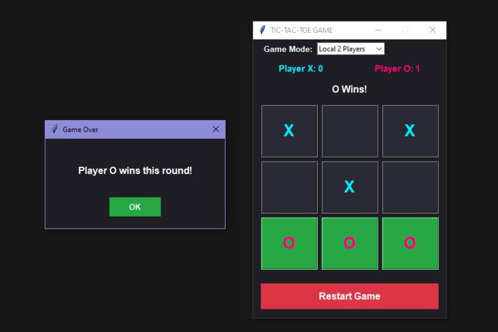

# 🎮 Tic-Tac-Toe Game

A modern Tic-Tac-Toe game built using Python and Tkinter with AI mode, 2-player support, and an interactive GUI.

## ✨ Features
- 🤖 Play against Computer AI
- 👥 Local 2 Player Mode
- 🎨 Modern GUI Design
- 🏆 Winner Highlighting
- 🔄 Restart Game Option

## 🛠️ Technologies Used
- Python
- Tkinter

## 🚀 How to Run the Project

### Option 1: Run via Python Source Code
To run the game using the script, make sure you have Python installed on your system:

1. **Download** the project as a ZIP file from GitHub and extract it.
2. Open your **Terminal** or **Command Prompt** and navigate to the project folder.
3. Run the following command:

```bash
python tic_tac_toe.py
```
### Option 2: Convert to a Standalone Desktop App (.exe)
To convert this script into a Windows application so anyone can play without installing Python:

1. Open your **Terminal** or **Command Prompt** and install PyInstaller using this command:
```bash
pip install pyinstaller
```
2. Navigate to your project folder inside the terminal and run the packaging command:
```bash
pyinstaller --noconsole --onefile tic_tac_toe.py
```
3. Open the newly created dist folder to find your standalone tic_tac_toe.exe file, ready to run!

## 📷 Preview

<p align="center">
  
  
</p>

<p align="center">
  
  
</p>

<p align="center">
  
</p>
