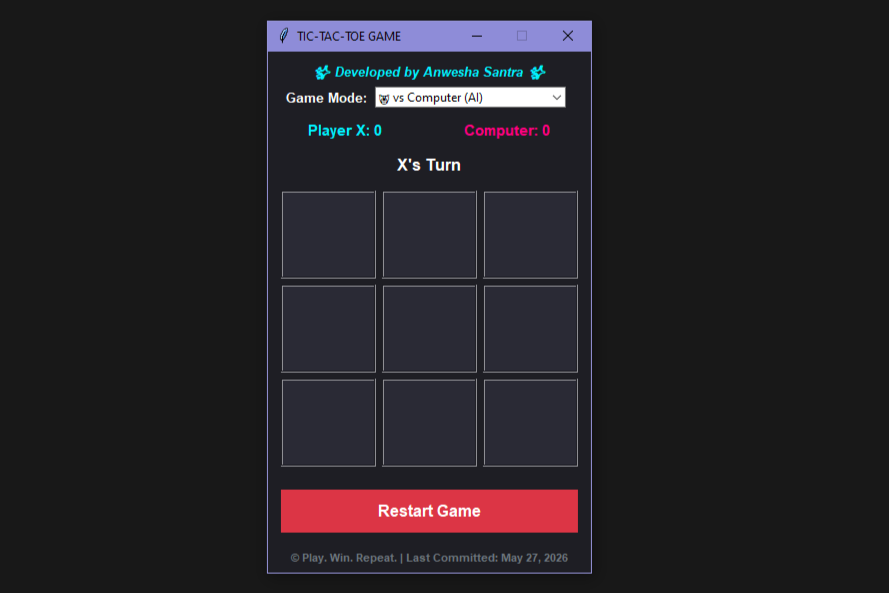
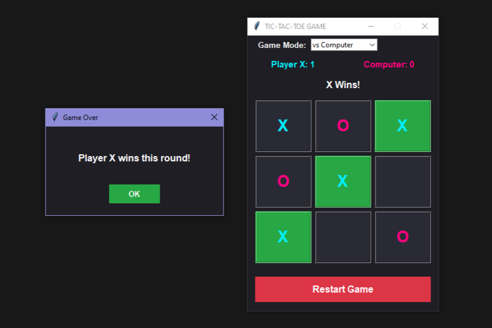
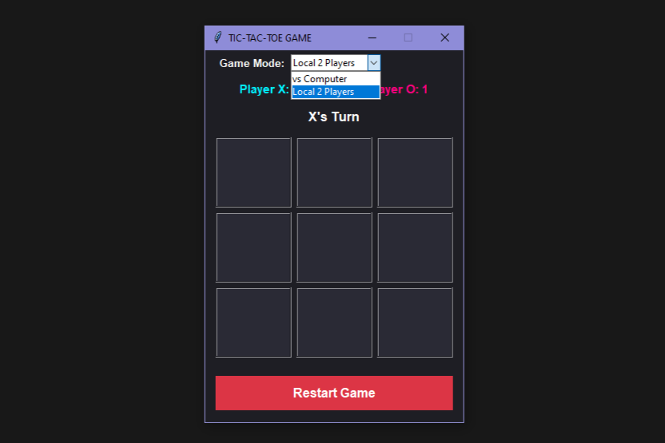
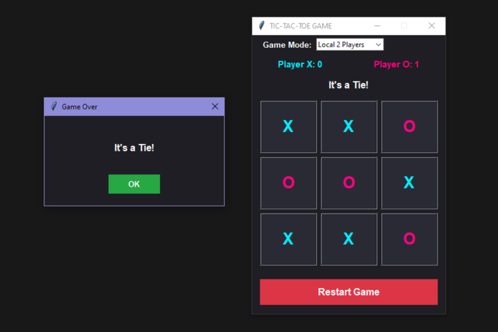

# 🎮 Tic-Tac-Toe Game

A modern Tic-Tac-Toe game built using Python and Tkinter.

## ✨ Features
- 🤖 Play against Computer AI
- 👥 Local 2 Player Mode
- 🎨 Modern GUI Design
- 🏆 Winner Highlighting
- 🔄 Restart Game Option

## 🛠️ Technologies Used
- Python
- Tkinter

## 🚀 How to Run

```bash
python tic_tac_toe.py
```

## 📸 Preview




